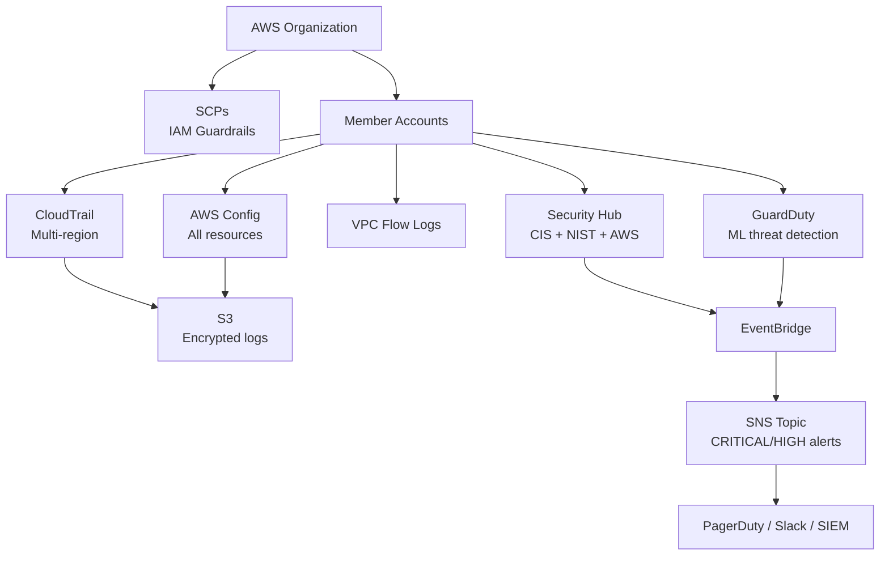

# Cloud Security Governance-as-Code

> Scalable, auditable cloud security controls for AWS — mapped to NIST SP 800-53 and ISO/IEC 27001, with commentary on why each control reduces risk, not just satisfies compliance.

[](LICENSE)
[](https://www.terraform.io/)
[](https://registry.terraform.io/providers/hashicorp/aws/latest)
[]()

---

## The Problem with Compliance-First Security

Most cloud governance implementations are compliance-first — they implement controls because a framework says so, not because they understand what risk they're reducing.

This toolkit takes the opposite approach: **every control is justified by the attack path it closes**, the detection gap it fills, or the blast radius it limits. The compliance mappings are a byproduct, not the goal.

---

## What's Inside

```
cloud-security-governance/
├── modules/
│   ├── iam-guardrails/          # IAM password policy, SCPs, least-privilege roles
│   ├── logging-baseline/        # CloudTrail, AWS Config, VPC Flow Logs
│   └── security-hub/            # Security Hub standards, GuardDuty, alerting
├── environments/
│   └── example/                 # Wires all modules together — copy to deploy
├── controls/
│   ├── nist-mapping.md          # NIST SP 800-53 Rev 5 control mapping
│   └── iso-mapping.md           # ISO/IEC 27001:2022 Annex A mapping
└── README.md
```

---

## Modules

### IAM Guardrails
**Controls:** AC-2, AC-3, AC-6, IA-5, IA-8 | A.5.18, A.8.2

- Account password policy (14 char minimum, 90-day rotation, 12-password history)
- SCP: Deny root account usage across all member accounts
- SCP: Deny disabling or deleting CloudTrail (prevents log tampering post-breach)
- SCP: Deny disabling S3 public access block (prevents data exposure misconfiguration)
- SCP: Deny leaving the AWS Organization (prevents governance bypass)
- Least-privilege security read-only role with MFA-required assume-role condition

### Logging Baseline
**Controls:** AU-2, AU-3, AU-6, AU-9, AU-12, SI-4 | A.8.15, A.8.16

- CloudTrail: multi-region, log file validation enabled, management + data events
- CloudTrail S3 bucket: KMS encryption, versioning, HTTPS-only policy, no public access
- AWS Config: all-resource recorder with delivery channel
- VPC Flow Logs: ALL traffic to CloudWatch with configurable retention

### Security Hub + GuardDuty
**Controls:** CA-7, IR-4, RA-5, SI-4 | A.8.8, A.8.16

- Security Hub with three standards: CIS, AWS Foundational Security Best Practices, NIST 800-53
- GuardDuty with S3 protection, optional Kubernetes and malware protection
- EventBridge rule routing CRITICAL/HIGH findings to encrypted SNS topic
- Ready to wire to PagerDuty, Slack, or SIEM

---

## Quick Start

### Prerequisites
- Terraform >= 1.5
- AWS credentials with org-level permissions (for SCPs)
- An existing AWS Organization

### Deploy

```bash
git clone https://github.com/rafatyazdani/cloud-security-governance.git
cd cloud-security-governance/environments/example

# Create your tfvars
cat > terraform.tfvars <<EOF
aws_region     = "us-east-1"
aws_account_id = "123456789012"
environment    = "prod"
vpc_ids        = ["vpc-xxxxxxxxx"]
alert_email    = "security@yourorg.com"
EOF

terraform init
terraform plan
terraform apply
```

### What Gets Deployed

| Resource | Count | Purpose |
|----------|-------|---------|
| IAM Password Policy | 1 | Enforce credential hygiene |
| SCPs | 4 | Root, CloudTrail, S3 public, leave-org guardrails |
| CloudTrail | 1 | Multi-region API audit trail |
| S3 Bucket (logs) | 1 | Encrypted, versioned log storage |
| AWS Config Recorder | 1 | Continuous resource configuration tracking |
| VPC Flow Logs | 1 per VPC | Network telemetry |
| Security Hub | 1 + 3 standards | Aggregated findings with CIS/NIST/AWS standards |
| GuardDuty | 1 | ML-based threat detection |
| SNS Topic | 1 | Critical findings alerting |

---

## Control Mappings

- [NIST SP 800-53 Rev 5 →](controls/nist-mapping.md)
- [ISO/IEC 27001:2022 Annex A →](controls/iso-mapping.md)

Each mapping includes the risk rationale — why the control matters beyond checkbox compliance.

---

## Architecture



---

## Design Principles

**Risk-first, compliance-as-byproduct**
Every control is chosen because it closes a real attack path. Compliance mappings are derived from that choice, not the other way around.

**Immutable audit trail**
SCPs make it impossible for any principal — including admins — to disable logging or leave the organization. Governance controls that can be bypassed by the people they govern are not controls.

**Least privilege by default**
No broad permissions. Every IAM resource in this toolkit is scoped to exactly what it needs, with MFA conditions on privileged assume-role paths.

**Observable by design**
Critical findings route automatically to SNS. Detection without alerting is detection that doesn't work at 2am.

---

## License

Apache 2.0 — free to use, adapt, and deploy in commercial contexts with attribution.

---

*Built by a CISSP + CPA with 10+ years in GRC and cloud security strategy.*
